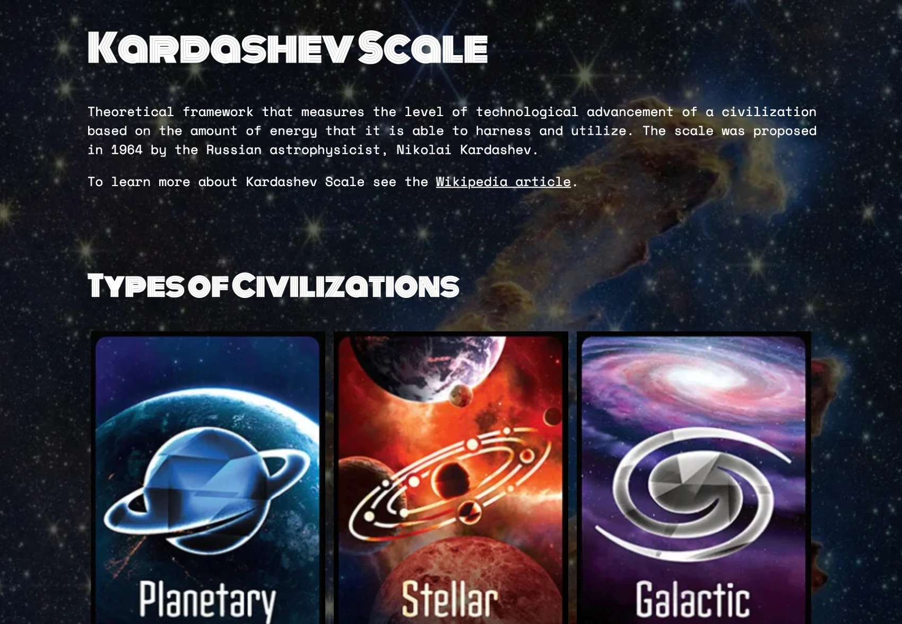

# Kardashev Scale

In Week 4 of BocaCode (C-10), students are taught the fundamentals of web development, including HTML and CSS. As part of the class project, we applied this knowledge to create a web page that explains the concept of the Kardashev Scale.

 

## Site
* 👉 [jsohndata.github.io/kardashev-scale](https://jsohndata.github.io/kardashev-scale/)

 

## Resource
* [Graphics From: Unfilter Gamer - Kardashev Scale](https://unfilteredgamer.com/review-kardashev-scale/)
* [W3Schools: CSS Filter](https://www.w3schools.com/cssref/playdemo.php?filename=playcss_filter)
* [W3Schools: CSS Cusor](https://www.w3schools.com/cssref/tryit.php?filename=trycss_cursor)
* [Webcode: CSS Drop Shadow](https://webcode.tools/generators/css/drop-shadow)
